<div align="center">

# 🍽️ Swiggy Food Delivery Analysis using PostgreSQL

### End-to-End SQL Project | PostgreSQL | Data Analysis | Business Intelligence

<p align="center">


</p>

</div>

---

# 📑 Table of Contents

- [📌 Project Overview](#-project-overview)
- [📊 Dataset Information](#-dataset-information)
- [🎯 Business Questions](#-business-questions)
- [🛠️ Tools & Technologies](#️-tools--technologies)
- [📚 SQL Concepts Covered](#-sql-concepts-covered)
- [📈 Project Workflow](#-project-workflow)
- [📷 SQL Analysis](#-sql-analysis)
- [💡 Key Business Insights](#-key-business-insights)
- [📂 Project Structure](#-project-structure)
- [🚀 How to Run](#-how-to-run)
- [👨‍💻 Author](#-author)

---

# 📌 Project Overview

This project presents an end-to-end analysis of a **Swiggy food delivery dataset** using **PostgreSQL**.

The objective is to extract meaningful business insights by analyzing restaurant menus, pricing strategies, customer ratings, and city-level trends using SQL.

The project demonstrates practical SQL skills through:

- Data Quality Assessment
- Exploratory Data Analysis (EDA)
- Business Problem Solving
- Advanced SQL Techniques
- Window Functions
- Common Table Expressions (CTEs)
- Views
- PostgreSQL User-Defined Functions

This project is designed to simulate real-world business reporting and analytical workflows commonly performed by Data Analysts.

---

# 📊 Dataset Information

| Metric | Value |
|---------|-------|
| Total Records | **197430** |
| Total Cities | **28** |
| Total States | **28** |
| Restaurants | **993** |
| Unique Dishes | **59064** |
| Food Types | **2 (Veg & Non-Veg)** |
| Categories | **4972** |
| Database | PostgreSQL |

---

# 🎯 Business Questions

The project answers several real-world business questions, including:

### 📌 Data Quality

- Is the dataset complete and free from missing values?
- Are there any invalid prices or ratings?

### 📌 Restaurant Analysis

- Which restaurants have the highest average ratings?
- Which restaurants offer the largest variety of dishes?
- Which restaurants have the highest average dish prices?

### 📌 Pricing Analysis

- Which cities have premium-priced menus?
- How are dishes distributed across different price segments?
- Which are the most expensive dishes on the platform?

### 📌 Food Analysis

- How do Veg and Non-Veg dishes compare?
- Which food categories contribute the most dishes?
- Which category has the highest average rating?

### 📌 Advanced Analytics

- How are restaurants ranked within each city?
- Which are the Top 3 restaurants in every city?
- Which is the highest-rated dish in each category?
- How can SQL Views simplify reporting?
- How can PostgreSQL Functions automate city-level reports?

---

# 🛠️ Tools & Technologies

| Tool | Purpose |
|------|---------|
| PostgreSQL | Database Management |
| pgAdmin 4 | Query Development |
| SQL | Data Analysis |
| Git | Version Control |
| GitHub | Project Portfolio |

---

# 📚 SQL Concepts Covered

## Basic SQL

- SELECT
- WHERE
- GROUP BY
- HAVING
- ORDER BY
- LIMIT
- DISTINCT
- Aggregate Functions

---

## Conditional Logic

- CASE WHEN

---

## Window Functions

- ROW_NUMBER()
- DENSE_RANK()
- LAG()
- NTILE()

---

## Common Table Expressions (CTEs)

- WITH Clause

---

## Database Objects

- Views
- PostgreSQL User-Defined Functions

---

## Aggregate Functions

- COUNT()
- SUM()
- AVG()
- MIN()
- MAX()

---

## Business Reporting

- Percentage Contribution
- Customer Rating Analysis
- Price Segmentation
- Restaurant Ranking
- City-Level Reporting

---

# 📈 Project Workflow

```text
              Swiggy Dataset
                     │
                     ▼
        Data Quality Assessment
                     │
                     ▼
      Exploratory Data Analysis
                     │
                     ▼
      Business Question Analysis
                     │
                     ▼
       Advanced SQL Techniques
                     │
                     ▼
         Views & SQL Functions
                     │
                     ▼
          Business Insights

# 📷 SQL Analysis

---

# 📊 SW1 – Dataset Overview

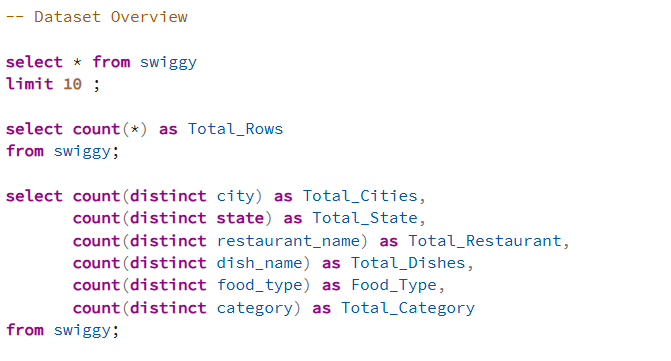

### **Business Question**

How large is the Swiggy dataset, and what is its overall coverage?

### **Key Insight**

* The dataset contains **59,064 records** across **28 cities** and **993 restaurants**.
* It includes thousands of unique dishes covering multiple food categories and food types.
* The dataset provides sufficient coverage for restaurant, pricing, and customer rating analysis.

---

# 📊 SW2 – Data Quality Assessment

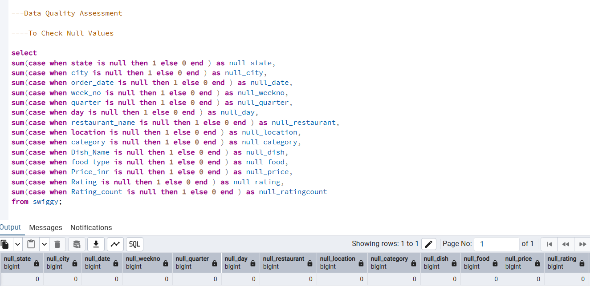

### **Business Question**

Is the dataset complete and suitable for business analysis?

### **Key Insight**

* No missing values were found across any column.
* No invalid prices or ratings were identified.
* The dataset is clean, consistent, and ready for analysis without additional preprocessing.

---

# 📊 SW3 – Veg vs Non-Veg Analysis

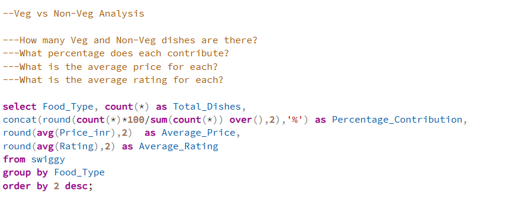

### **Business Question**

How do Veg and Non-Veg dishes compare in terms of availability, pricing, and customer ratings?

### **Key Insight**

* Vegetarian dishes contribute the majority of menu items available on the platform.
* Average pricing and customer ratings vary between Veg and Non-Veg dishes.
* The analysis helps understand customer preferences across different food types.

---

# 📊 SW4 – City-wise Price Analysis

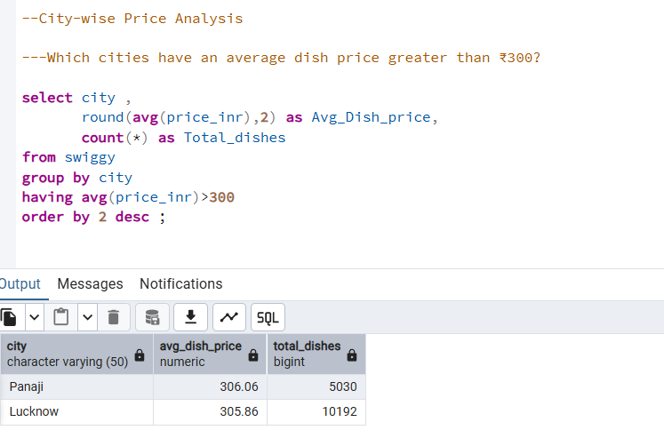

### **Business Question**

Which cities have an average dish price greater than ₹300?

### **Key Insight**

* Only a few cities have an average dish price above ₹300.
* These cities represent premium pricing markets compared to the rest of the platform.
* The results highlight geographical differences in menu pricing.

---

# 📊 SW5 – Weekday vs Weekend Analysis

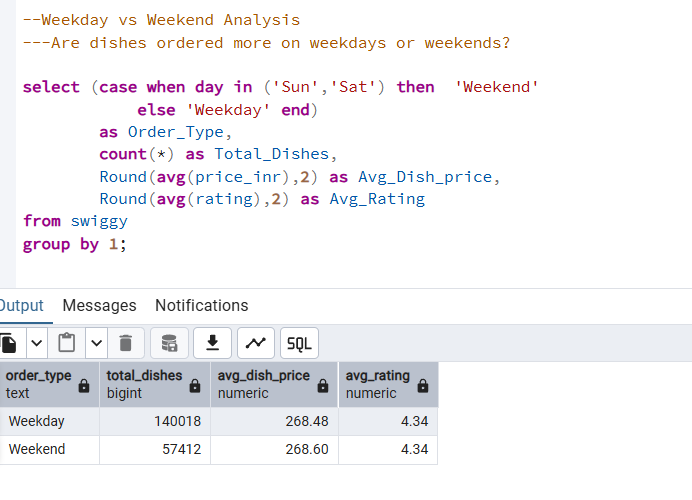

### **Business Question**

How do weekday and weekend orders compare?

### **Key Insight**

* The analysis compares total dishes, average prices, and customer ratings between weekdays and weekends.
* Differences in ordering patterns can help businesses optimize staffing and promotional campaigns.
* Customer behaviour varies across different days of the week.

---

# 📊 SW6 – Price Segmentation Analysis

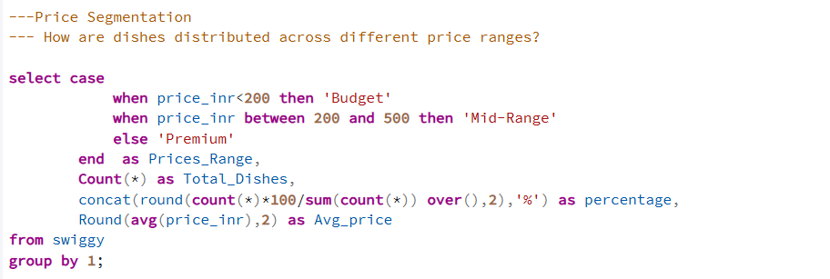

### **Business Question**

How are dishes distributed across different price segments?

### **Key Insight**

* Dishes are classified into Budget, Mid-Range, and Premium categories using `CASE WHEN`.
* Most dishes belong to the Budget and Mid-Range segments.
* Price segmentation helps understand menu affordability and pricing strategy.

---

# 📊 SW7 – City Summary View

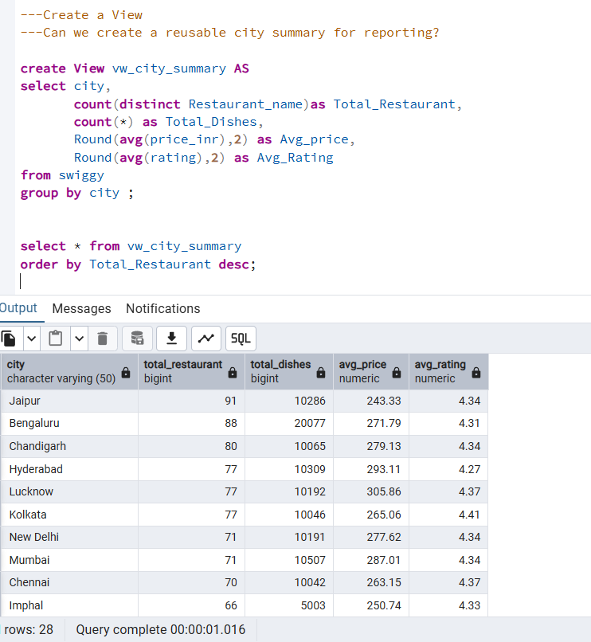

### **Business Question**

Can a reusable SQL View simplify city-level reporting?

### **Key Insight**

* A reusable SQL View was created to summarize city-wise restaurant performance.
* The View returns total restaurants, total dishes, average price, and average rating for every city.
* It simplifies reporting by eliminating the need to repeatedly write complex aggregation queries.

---
# 📊 SW8 – Top Rated Restaurants

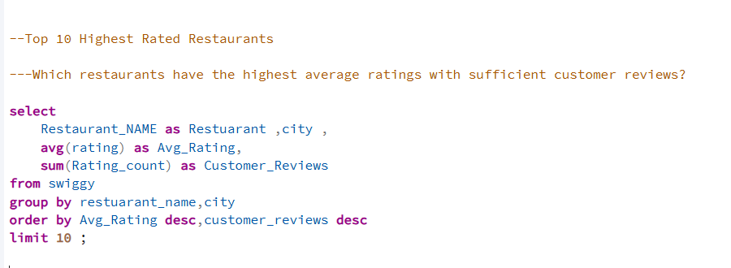

### **Business Question**

Which restaurants have the highest average customer ratings along with sufficient customer reviews?

### **Key Insight**

* Restaurants are ranked based on average customer ratings and total review counts.
* Combining ratings with review volume provides a more reliable measure of restaurant performance.
* Highly rated restaurants with many reviews indicate consistent customer satisfaction.

---

# 📊 SW9 – Restaurant Ranking Within Each City

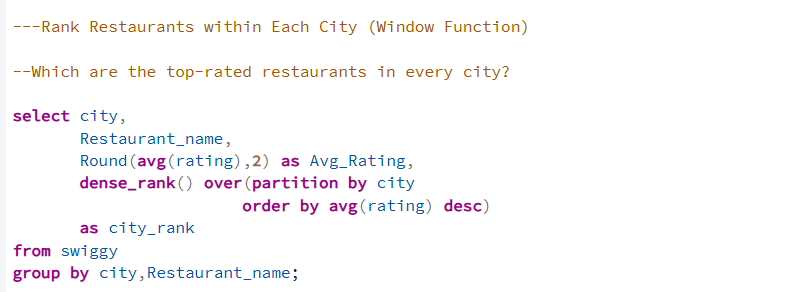

### **Business Question**

How do restaurants rank based on average customer ratings within each city?

### **Key Insight**

* Restaurants are ranked using the `DENSE_RANK()` window function.
* Rankings allow easy comparison of restaurant performance within the same city.
* This analysis helps identify local market leaders.

---

# 📊 SW10 – Top 3 Restaurants in Every City

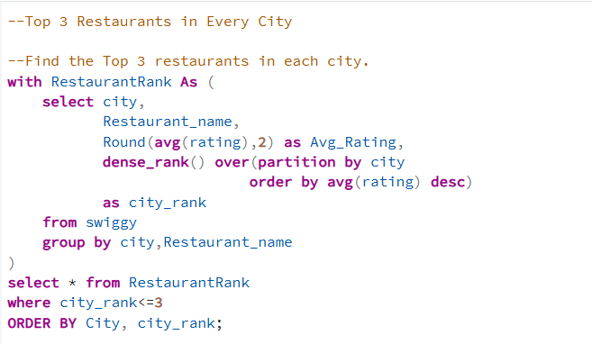

### **Business Question**

Which are the Top 3 highest-rated restaurants in every city?

### **Key Insight**

* A Common Table Expression (CTE) combined with `DENSE_RANK()` identifies the top-performing restaurants.
* This approach provides city-wise recommendations based on customer ratings.
* The solution demonstrates practical use of CTEs and window functions.

---

# 📊 SW11 – Most Expensive Dish in Each Category

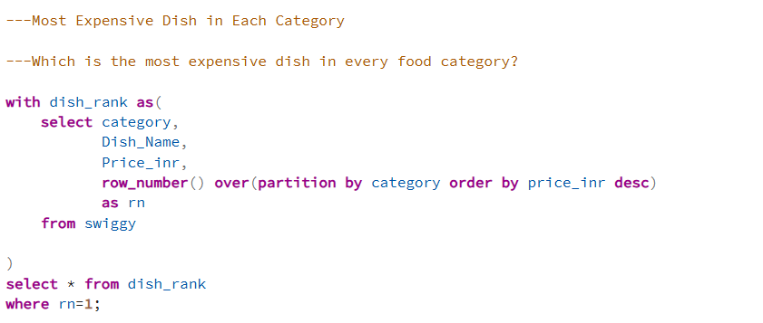

### **Business Question**

Which is the most expensive dish in every food category?

### **Key Insight**

* `ROW_NUMBER()` is used to identify the highest-priced dish within each category.
* The analysis highlights premium offerings across different cuisines.
* It helps compare pricing strategies among food categories.

---

# 📊 SW12 – Category Contribution Analysis

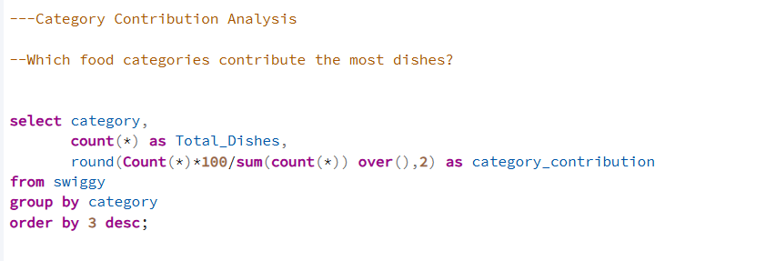

### **Business Question**

Which food categories contribute the highest number of dishes?

### **Key Insight**

* The contribution of each food category is calculated as a percentage of total dishes.
* Categories with higher contributions dominate restaurant menus.
* This helps identify the most popular cuisine segments on the platform.

---

# 📊 SW13 – Price Quartile Analysis

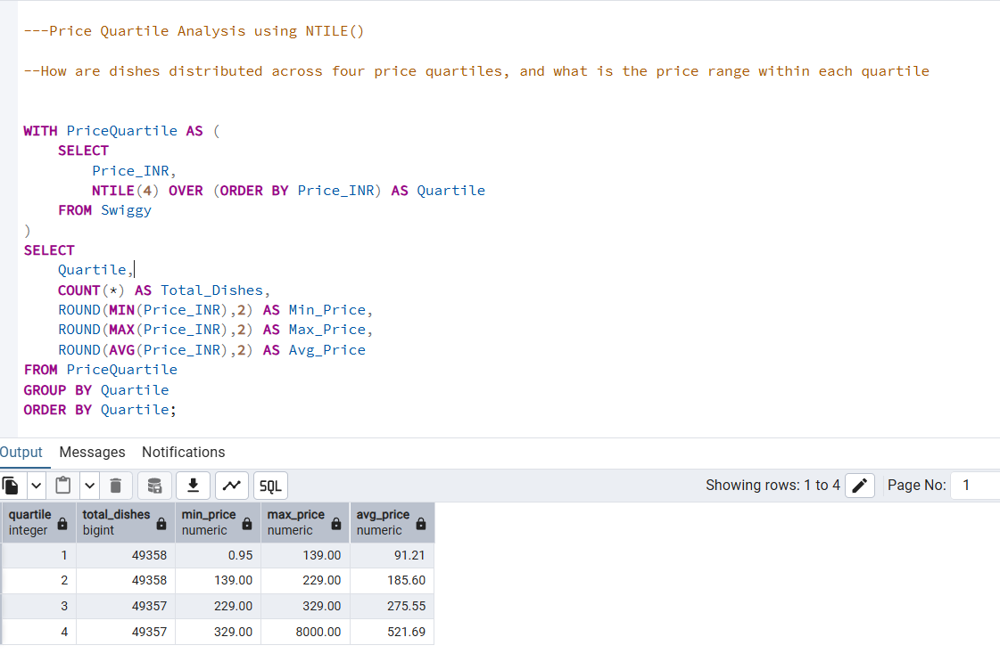

### **Business Question**

How are dishes distributed across four price quartiles?

### **Key Insight**

* The `NTILE()` window function divides dishes into four equal price groups.
* Each quartile represents a different pricing segment ranging from economical to premium.
* This analysis provides a structured view of menu pricing distribution.

---

# 📊 SW14 – PostgreSQL User-Defined Function

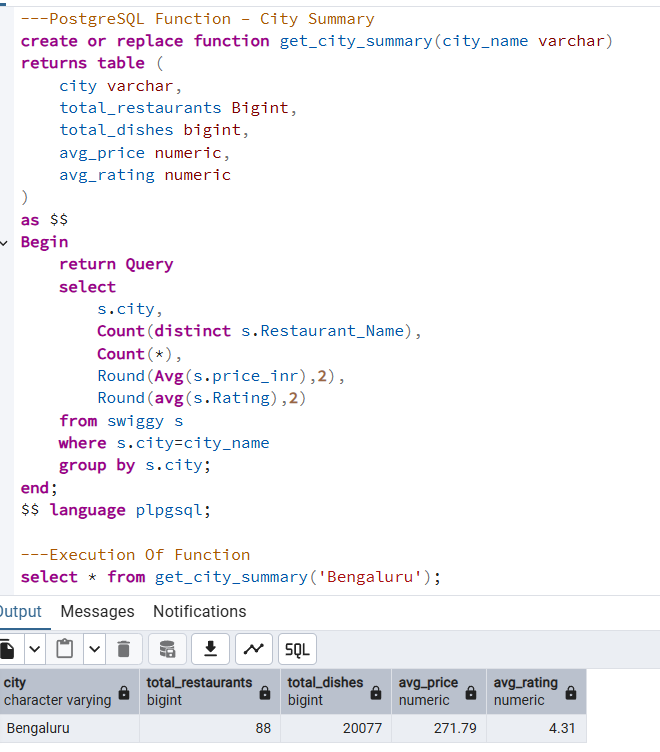

### **Business Question**

Can a reusable PostgreSQL function generate city-level restaurant reports?

### **Key Insight**

* A reusable function named `get_city_summary()` was created.
* The function accepts a city name as a parameter and returns restaurant KPIs.
* This demonstrates modular SQL development and reusable reporting.

---

# 💡 Key Business Insights

### 🥗 Food Type Analysis

* Vegetarian dishes represent the majority of menu offerings.
* Veg and Non-Veg dishes differ in pricing and customer ratings.

---

### 💰 Pricing Analysis

* Budget and Mid-Range dishes dominate the platform.
* Only a few cities have an average dish price exceeding ₹300.
* Premium dishes account for a smaller share of the overall menu.

---

### ⭐ Restaurant Performance

* Several restaurants consistently maintain excellent customer ratings.
* Review count should be considered alongside ratings when identifying top performers.

---

### 🌍 City-Level Insights

* Restaurant availability varies across cities.
* Pricing and customer satisfaction differ by location.
* City-level summaries support regional business analysis.

---

### 📈 Advanced SQL Implementation

This project demonstrates practical implementation of:

* Common Table Expressions (CTEs)
* Window Functions
* Views
* PostgreSQL User-Defined Functions
* Business Reporting Queries

---

# 📂 Project Structure

```text
Swiggy-SQL-Analysis
│
├── README.md
│
├── Dataset
│   └── Swiggy.csv
│
├── SQL
│   ├── 01_Create_Table.sql
│   ├── 02_Data_Quality_Assessment.sql
│   ├── 03_Basic_Business_Analysis.sql
│   └── 04_Advanced_SQL_Analysis.sql
│
└── Screenshots
    ├── SW1.png
    ├── SW2.png
    ├── SW3.png
    ├── SW4.png
    ├── SW5.png
    ├── SW6.png
    ├── SW7.png
    ├── SW8.png
    ├── SW9.png
    ├── SW10.png
    ├── SW11.png
    ├── SW12.png
    ├── SW13.png
    └── SW14.png
```

---

# 🚀 How to Run This Project

1. Clone this repository.
2. Open PostgreSQL and pgAdmin.
3. Execute `01_Create_Table.sql`.
4. Import the `Swiggy.csv` dataset.
5. Run the SQL files in the following order:

   * `02_Data_Quality_Assessment.sql`
   * `03_Basic_Business_Analysis.sql`
   * `04_Advanced_SQL_Analysis.sql`
6. Compare your outputs with the screenshots provided in the repository.

---

# 🎯 Learning Outcomes

Through this project, I gained practical experience in:

* Writing optimized SQL queries
* Performing data quality assessment
* Solving business problems using SQL
* Implementing Common Table Expressions (CTEs)
* Applying Window Functions
* Creating reusable SQL Views
* Developing PostgreSQL User-Defined Functions
* Building business-focused analytical reports

---

# 👨‍💻 Author

## **Madhu Kamane**

**Aspiring Data Analyst**

### Skills

* PostgreSQL
* SQL
* Excel
* Power BI
* Python
* Data Visualization
* Statistics

---

<div align="center">

### ⭐ If you found this project useful, consider giving it a Star!

**Thank you for visiting my project!**

</div>


